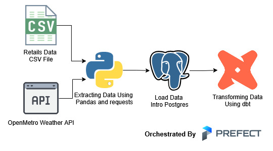
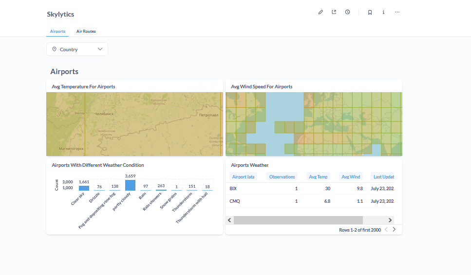
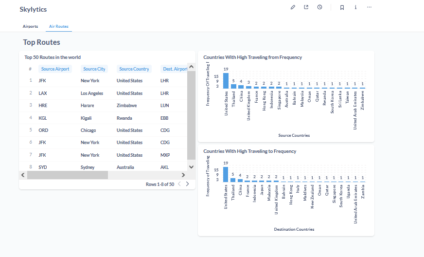
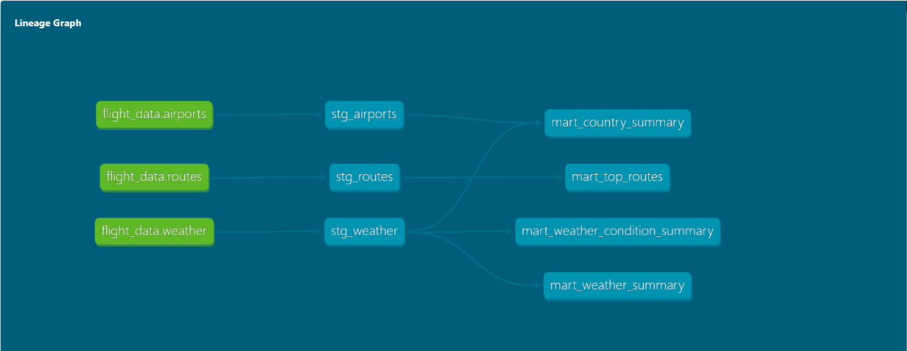

# ✈️ Skylytics: Weather-Aware Flight Analytics

**Skylytics** is an end-to-end data engineering and analytics project designed to integrate, transform, and visualize global flight route and weather data. The pipeline extracts raw data from APIs and CSV sources, enriches it with live weather data, and loads it into a PostgreSQL warehouse for analytics via dbt and Metabase.

---

## 🧠 Project Goals

- Build a modular, production-grade ELT pipeline using Python and Prefect
- Integrate real-time weather data from Open-Meteo API for 6000+ airports
- Model clean and analytics-ready datasets using dbt
- Visualize flight and weather insights using Metabase dashboards
- Showcase core data engineering skills with modern tooling

---

## 🧰 Tech Stack

| Layer         | Tools Used                                      |
|---------------|--------------------------------------------------|
| Ingestion     | Python, `requests`, `pandas`                    |
| Orchestration | Prefect 2                                       |
| Storage       | PostgreSQL                                      |
| Modeling      | dbt                                              |
| Visualization | Metabase                                        |
| DevOps        | Docker                                          |

---

## 📦 Data Sources

- **Airports & Routes**: [OpenFlights.org](https://openflights.org/data.html)
- **Weather Data**: [Open-Meteo API](https://open-meteo.com)

---

## 🗂️ Project Structure
```
skylytics/
├── etl/ # ETL scripts using Prefect
│ ├── extract.py
│ └── load_to_postgres.py
├── dbt/
│ ├── models/
│ │ ├── staging/
│ │ └── marts/
│ └── dbt_project.yml
├── sql/
│ └── tables.sql # DDL for PostgreSQL schema
├── dashboard_exports/
│ └── dashboard_skylytics.json (optional)
├── assets/
│ └── dashboard_*.png # Screenshots of Metabase dashboards
├── .env
└── README.md
```
---

## 🏗️ Pipeline Overview



1. **Extract**
   - Read airports and routes from CSV
   - Use Open-Meteo API to enrich with weather by lat/lon

2. **Load**
   - Write data to PostgreSQL using SQLAlchemy

3. **Transform**
   - Clean and normalize in staging tables using dbt
   - Aggregate into marts: weather, routes, country summary

4. **Visualize**
   - Build Metabase dashboards using marts as sources

---

## 📊 Dashboards Preview

### ✈️ Airport Weather Summary


### 🌍 Top 50 Busiest Routes


---

## 📈 dbt Models



### Staging Models
- `stg_airports`
- `stg_routes`
- `stg_weather`

### Mart Models
- `mart_weather_summary`
- `mart_country_weather_summary`
- `mart_weather_condition_summary`
- `mart_top_routes`

---

## ✅ Features Implemented

- ✅ Real-world API integration with caching and retries
- ✅ 6000+ airport weather enrichment
- ✅ PostgreSQL schema creation + loading
- ✅ Modular dbt modeling and testing
- ✅ Production-ready data pipeline with Prefect
- ✅ Dashboard design with Metabase

